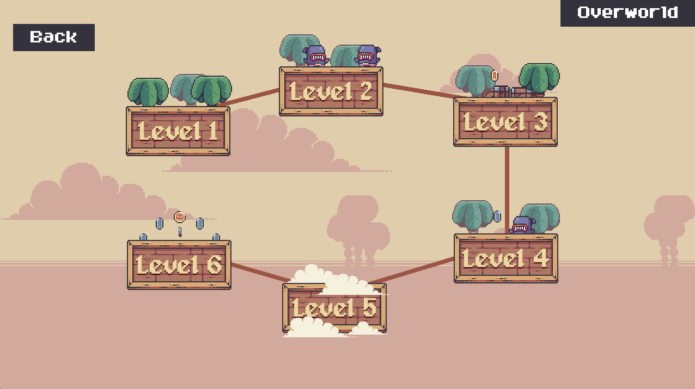
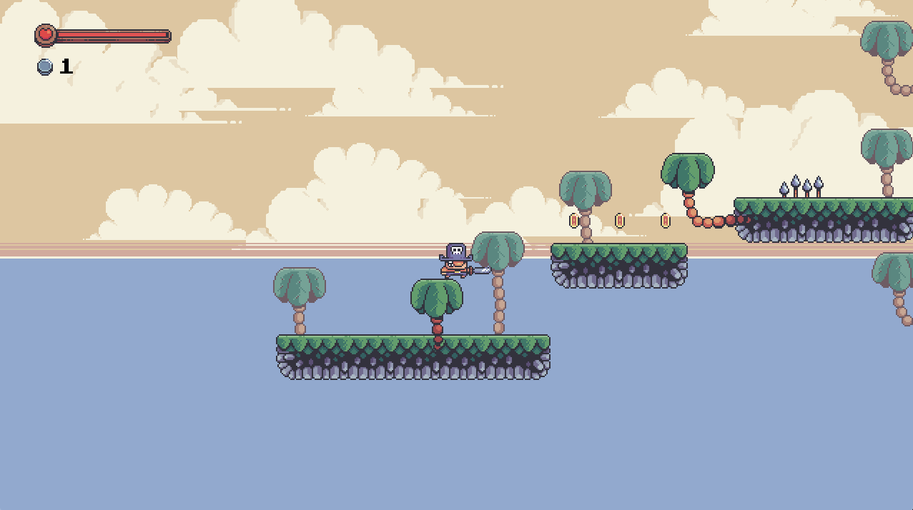

# PirateMaker

Project files for a Mario Maker inspired game
Based on Christian Koch / Clear Code 
Youtube video : https://www.youtube.com/watch?v=qYomF9p_SYM&t=20813s&ab_channel=ClearCode

The code is public domain / CC0. You can copy, modify, distribute and perform the work, even for commercial purposes, all without asking permission.
Attribution would be appreciated but is not required. 
More information on the license: https://creativecommons.org/publicdomain/zero/1.0/

The artwork is from Pixelfrog and can be found here: https://pixelfrog-assets.itch.io/treasure-hunters
It is also published under a CC0 license. 

The 2 pieces of background music are: 
explorer theme - https://opengameart.org/content/8-bit-explorer-theme
adventure theme/ SuperHero - https://opengameart.org/content/adventure-theme

## Thanks

## Running

* $ pip install -r requirements.txt
* $ cd game
* $ python3 main.py

## Dependency	
* pygame	

## Preview

